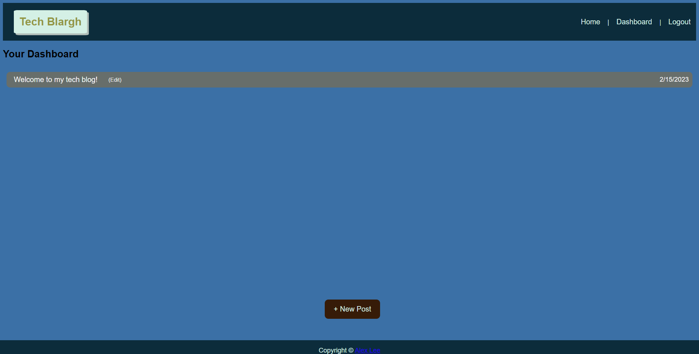

# Tech-Blog

## Description

This application for web developers serves as a place to share thoughts on the latest or upcoming technology. Users will be able to create, edit, or delete blog posts. They will also be able to add a comment on a post. 

## Installation

N/A

## Usage

Visit the deployed application here: 

## Screenshots

### Homepage

### Login 

### Dashboard

### New Post

### Editing A Post

### Comment

### Technologies Used

    * mysql2

    * Express
    
    * handlebars
    
    * bcrypt
    
    * sequelize

## License

This project is licensed under the MIT License - see the LICENSE.md file for details
